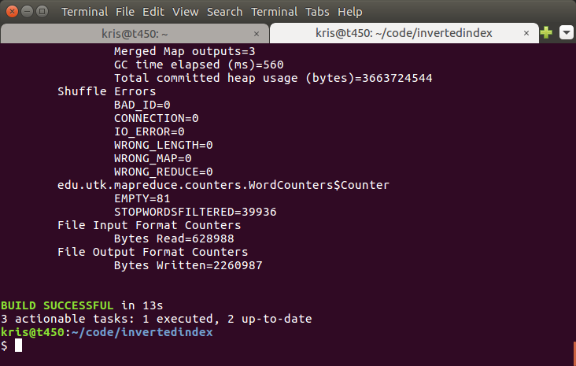
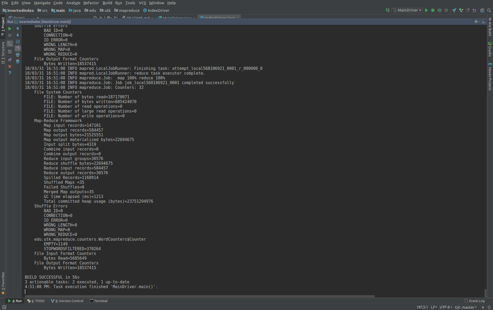
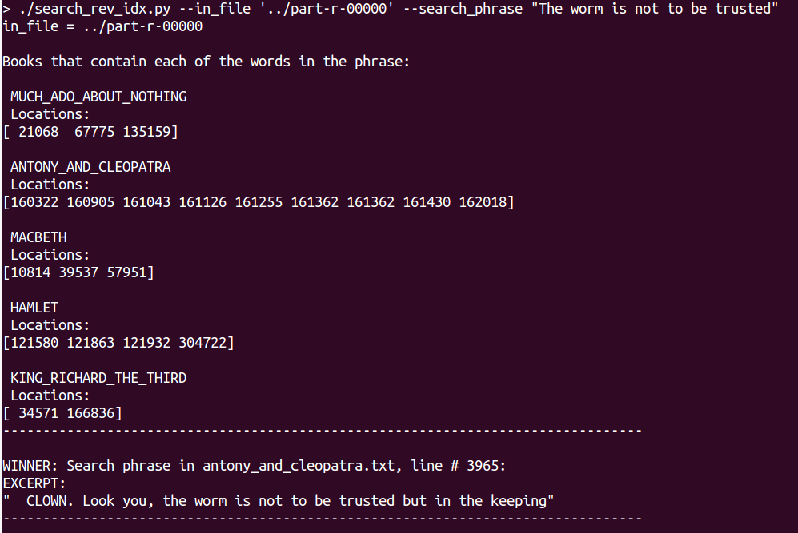
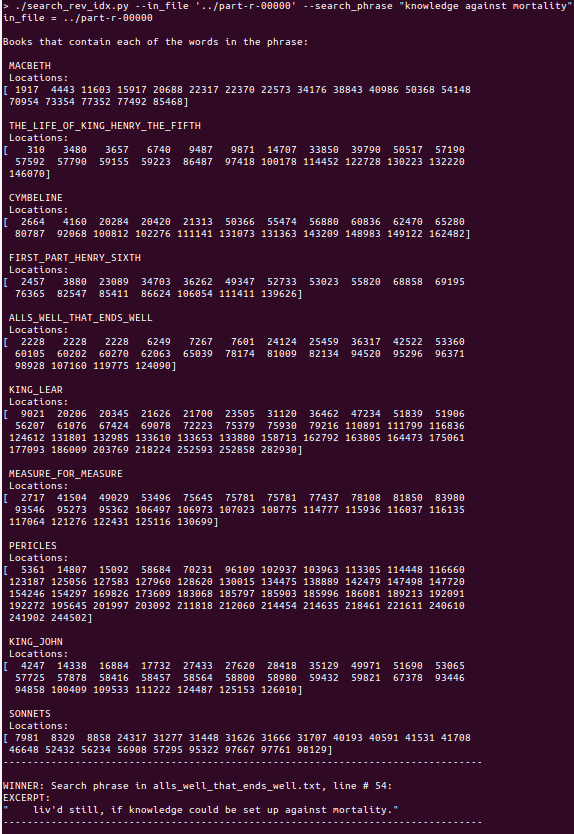

# invertedindex
Inverted index with mapreduce

#  Running the program

To run the hadoop job to build the inverted index, start by cloning the repository:

    git clone https://github.com/kbrown42/invertedindex.git

Change directory into the repository.  We used gradle to handle our building and running.  So run:

    ./gradlew build

to build the project. Note: This requires Java 8 be installed on your machine. To run the script run: 

    ./gradlew run -Param="['inputFilesDirectory', 'outputFilesDirectory']"
    
When it finishes, you should see something similar to:   

# Identifying and removing stop words
For online search engines, 'stop word' detection is an important component for removing words that are considered noise as compared to the more meaningful words and phrases with pertinent meaning to the user. We address this issue in our work by implementing a stop words filter based on frequency of occurrence. In practice for the works of Shakespeare, we find that a filter of approximately 0.5% of total word count is sufficient for extracting less meaningful words from the data set. For example, words such as "a, all, and, be, but" are among the highest scoring occurrences for frequency. In total, while building the inverted search index, 370,264 stop words were removed.  We implemented some custom counters to track such metrics. This removal allows to system resources to do more meaningful computations in order to serve faster and higher quality results to the user. For convenience, we designed this module to output a list of the stop words which allows for easy review and application access to this list and also allowed us to compare our list to other commonly used stop word lists. 
This approach also allows us to manually modify the 'scrubbing' process as needed by editing this file. Our list of applied stop words can be seen in the src/main/resources/stop_words.txt file. 

A image showing a couple of our counters at the end of a run can be seen below.  
 

  

# Building the Inverted Index 
We decided to use Java for constructing and running the mapreduce jobs.  In addition, we used the build tool Gradle to manage dependencies and make running and testing very simple.  

The inverted index program runs in three distinct pipeline stages.  Each stage is clearly separated out into its own class that implements the Hadoop class `Tool`.  This is a simple wrapper that makes running a job from a main function quite simple.  The three stages are: gather word counts, filter out stop words based on word frequency, and construct the index using the previously determined stop word list.  The drivers are located in the `edu.utk.mapreduce` package.    

Our approach to building the inverted index was to create several mapper and reducer classes that are incredibly simple and easy to understand but perform primitive tasks that can be chained together.  This is easily accomplished by using the `ChainMapper` class in Hadoop.  For instance, our word count job looks like:

    Tokenizer -> LowerCaser -> RegExFilter -> Counter -> SumReducer
    
The inverted index pipeline is very similar:

    Tokenizer -> LowerCase -> RegExFilter -> StopWordsFilter -> IndexReducer
    

The outputs for a the word count job and the task that compiles a list of stop words can be seen in the `outputs` folder of this repository.  The inverted index can also be found there.

We also made a couple of utilities and helpers for this project.  There is a `StopWordListReader` that takes in the stopwords.txt file and stores it as a HashSet that a mapper can use to filter out words efficiently.  We also made custom counters which can be found in `edu.utk.mapreduce.counters`. Finally, we made a custom `Writable` object that can be passed between mappers and reducers.  This is a simple class that stores the filename and file offset position for each term in the corpus.  This class can be found in `edu.utk.mapreduce.customtypes`.

# Query the Inverted Index 
This module serves as a general user interface for our search engine capabilities. It accepts a search phrase from the user and accesses the inverted index data in order to provide the user with the best match for file and line number of their query match. 
Although excerpt extraction was not required for this project, we added this feature in order to showcase our systems ability to provide results to the user in a helpful manor while providing a more classical search engine experience. This search module checks each word of the phrase for occurrences and then uses set operations to find out where the phrase elements in totality occur together. Finally, the best phrase match for file and line number are provided, the information is extracted from the book and book excerpt is served to the user.  
Example queries and results are provided below.  
 
Example 1: User Query: "five wits went halting off"  
In this example the phrase elements are found in MUCH_ADO_ABOUT_NOTHING, TWO_NOBLE_KINSMEN, HAMLET, and HISTORY_OF_TROILUS_AND_CRESSIDA.  
The best match is found to be much_ado_about_nothing.txt on line 198 and the excerpt from the book is provided.  

  
Example 2: User Query: "The worm is not to be trusted"  
In this example the phrase elements are found in 5 books.  
The best match is found to be much_antony_and_cleopatra.txt, line on line 3965 and the excerpt from the book is provided.  

  
Example 3: User Query: "knowledge against mortality"  
In this example the phrase elements are found in 10 books.  
The best match is found to be alls_well_that_ends_well.txt, line on line 54 and the excerpt from the book is provided.  

  

# Extra credit:  Integrate queries with Spark
We implemented a Spark program which is able to read in the inverted index file output by mapreduce and perform queries.  Both the Jupyter notebook and an accompanying html file are included here.  The html file is SparkIndexQuerying.html.  It's easiest to open that file in your browser rather than starting up a Jupyter notebook server.  

