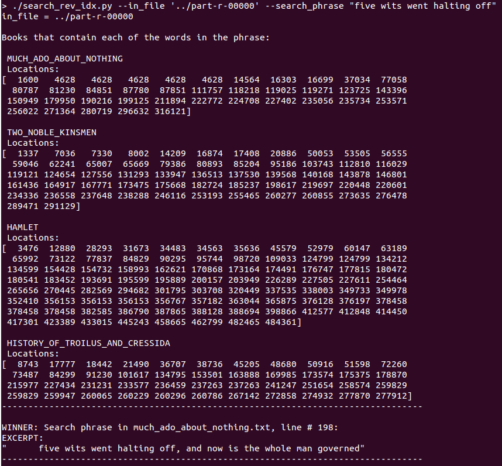

# invertedindex
Inverted index with mapreduce

# Identifying and removing stop words
For online search engines, 'stop word' detection is an important component for removing words that are considered noise as compared to the more meaningful words and phrases with pertinent meaning to the user. We address this issue in our work by implementing a stop words filter based on frequency of occurrence. In practice for the works of Shakespeare, we find that a filter of approximately 0.5% of total word count is sufficient for extracting less meaningful words from the data set. For example, words such as "a, all, and, be, but" are among the highest scoring occurrences for frequency. In total, while building the inverted search index, X [35k?, KRIS TODO] stop words were removed. This removal allows to system resources to do more meaningful computations in order to serve faster and higher quality results to the user. For convenience, we designed this module to output a list of the stop words which allows for easy review and application access to this list and also allowed us to compare our list to other commonly used stop word lists. 
This approach also allows us to manually modify the 'scrubbing' process as needed by editing this file. Our list of applied stop words can be seen in the stop_words.txt file. 

# Query the Inverted Index 
This module serves as a general user interface for our search engine capabilities. It accepts a search phrase from the user and accesses the inverted index data in order to provide the user with the best match for file and line number of their query match. 
Although excerpt extraction was not required for this project, we added this feature in order to showcase our systems ability to provide results to the user in a helpful manor while providing a more classical search engine experience. This search module checks each word of the phrase for occurrences and then uses set operations to find out where the phrase elements in totality occur together. Finally, the best phrase match for file and line number are provided, the information is extracted from the book and book excerpt is served to the user.  
Example queries and results are provided below.  
Example 1: User Query: "five wits went halting off"  
In this example the phrase elements are found in MUCH_ADO_ABOUT_NOTHING, TWO_NOBLE_KINSMEN, HAMLET, and HISTORY_OF_TROILUS_AND_CRESSIDA.  
The best match is found to be much_ado_about_nothing.txt on line 198 and the excerpt from the book is provided.  

